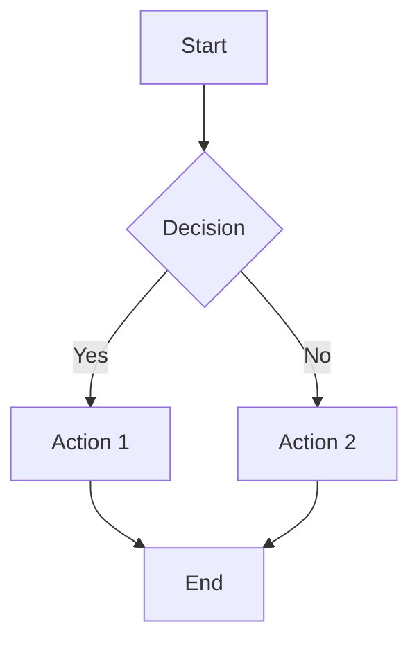
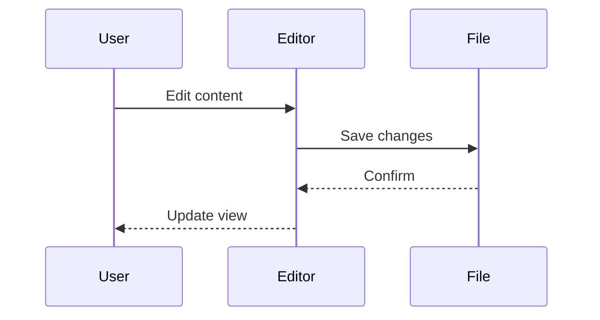

# Feature Test: Markdown Live Editor

## Headings

### H3 Heading

#### H4 Heading

##### H5 Heading

###### H6 Heading

---

## Text Formatting

This is **bold**, this is *italic*, this is ***bold italic***.

This is ~~strikethrough~~ text.

This is `inline code` in a sentence.

---

## Links and Images

[VS Code](https://code.visualstudio.com/)


---

## Lists

### Unordered

- Item 1
- Item 2
  - Nested item A
  - Nested item B
- Item 3

### Ordered

1. First
2. Second
3. Third

### Task List

- [x] Completed task
- [ ] Incomplete task
- [x] Another done task

---

## Blockquote

> This is a blockquote.
>
> It can span multiple lines.

---

## GitHub Alerts

> [!NOTE]
> Useful information that users should know.

> [!TIP]
> Helpful advice for doing things better.

> [!IMPORTANT]
> Key information users need to know.

> [!WARNING]
> Urgent info that needs immediate attention.

> [!CAUTION]
> Potential risks or negative outcomes.

---

## Table

| Feature | Status | Notes |
|---------|--------|-------|
| GFM Tables | Done | With alignment |
| Task Lists | Done | Checkboxes |
| Mermaid | Done | Live preview |
| KaTeX | Done | Inline & block |

---

## Code Blocks

### TypeScript

```typescript
interface User {
  name: string;
  age: number;
}

function greet(user: User): string {
  return `Hello, ${user.name}!`;
}
```

### Python

```python
def fibonacci(n: int) -> list[int]:
    a, b = 0, 1
    result = []
    for _ in range(n):
        result.append(a)
        a, b = b, a + b
    return result

print(fibonacci(10))
```

### JSON

```json
{
  "name": "markdown-live-editor",
  "version": "0.0.1",
  "features": ["syntax-highlighting", "mermaid", "katex"]
}
```

### No Language (auto-detect)

```
const x = 42;
console.log(x);
```

---

## Mermaid Diagrams

### Flowchart



### Sequence Diagram



---

## KaTeX Math

### Inline

The equation $E = mc^2$ is famous. Also $\sum_{i=1}^{n} i = \frac{n(n+1)}{2}$.

### Block

$$
\int_{0}^{\infty} e^{-x^2} dx = \frac{\sqrt{\pi}}{2}
$$

$$
\begin{pmatrix}
a & b \\
c & d
\end{pmatrix}
\begin{pmatrix}
x \\
y
\end{pmatrix}
=
\begin{pmatrix}
ax + by \\
cx + dy
\end{pmatrix}
$$

---

## Emoji

:smile: :+1: :rocket: :warning: :heart: :star: :fire: :bug:

---

## Footnotes

This has a footnote[^1] and another[^2].

[^1]: First footnote content.
[^2]: Second footnote with **formatting**.

---

## Horizontal Rules

Above

---

Below
